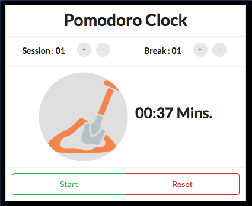
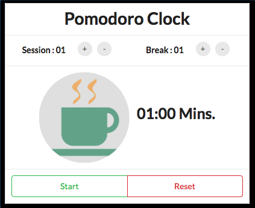

# FCC - Pomodoro Clock

| Work                           | Break                           |
|:------------------------------:|:-------------------------------:|
|||

###Introduction
The Pomodoro Technique is a time management method developed by Francesco Cirillo in the late 1980s.  The technique uses a timer to break down work into intervals, traditionally 25 minutes in length, separated by short breaks. These intervals are named pomodoros, the plural in English of the Italian word pomodoro (tomato), after the tomato-shaped kitchen timer that Cirillo used as a university student.

###Rules
There are six steps in the technique:
1. Decide on the task to be done.
2. Set the pomodoro timer (traditionally to 25 minutes).
3. Work on the task until the timer rings.
4. After the timer rings put a checkmark on a piece of paper.
5. If you have fewer than four checkmarks, take a short break (3–5 minutes), then go to step two.
6. After four pomodoros, take a longer break (15–30 minutes), reset your checkmark count to zero, then go to step 1.

For the purposes of the technique, a pomodoro is the interval of time spent working. After task completion, any time remaining in the pomodoro is devoted to overlearning. Regular breaks are taken, aiding assimilation. A short (3–5 minutes) rest separates consecutive pomodoros. Four pomodoros form a set. A longer (15–30 minute) rest is taken between sets.

A goal of the technique is to reduce the impact of internal and external interruptions on focus and flow. A pomodoro is indivisible. When interrupted during a pomodoro, either the other activity must be recorded and postponed (inform – negotiate – schedule – call back) or the pomodoro must be abandoned.

### Demonstration
To see the website visit this URL: [https://codesurge-xyz.github.io/fcc-pomodoro-clock](https://codesurge-xyz.github.io/fcc-pomodoro-clock/)